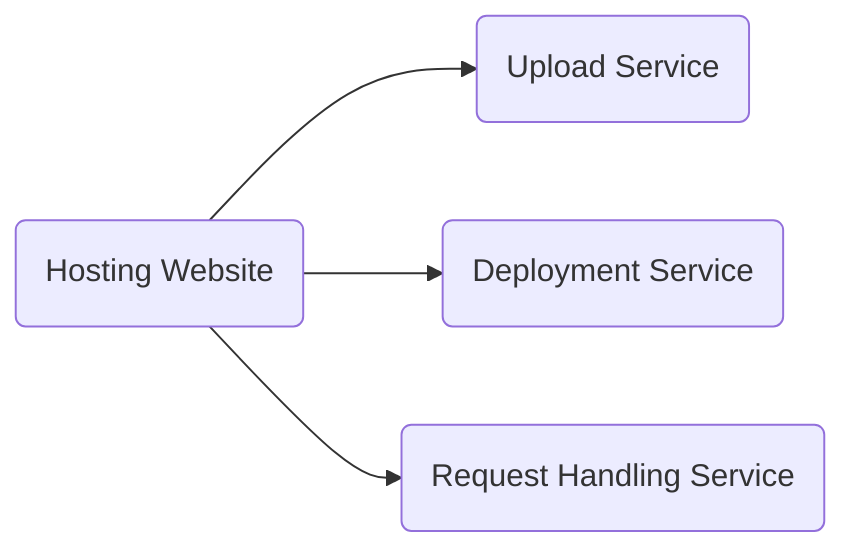
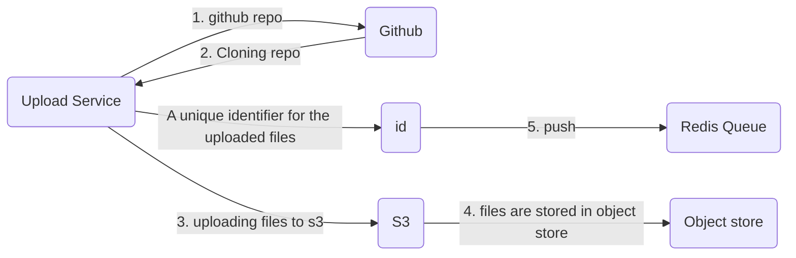
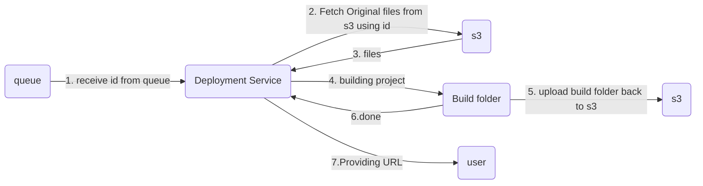
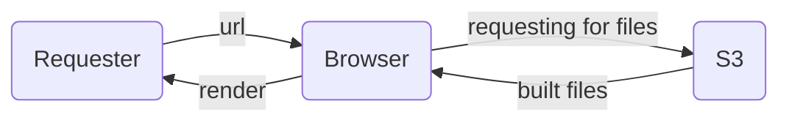

There are 3 services which need to be made for the hosting platform : 

## Upload Service
In upload service,we upload the files of our project to a remote **object store** like the one which **s3** provides. The process begins with cloning files from remote git url to our system and then using aws-sdk to upload those files to s3. After this process we push **id** into **redis queue** which acts as an unique identifier to access files from s3 . Inserting **id** into the queue also sends a signal to the deployment servers to take the charge.

## what are Object stores ? 
Object stores are cloud-based storage solutions for managing data as objects, each containing data and metadata. They offer scalability, durability, and accessibility via APIs, making them ideal for storing various types of unstructured data, including code files, images, and documents. Popular examples include Amazon S3, Google Cloud Storage, and Microsoft Azure Blob Storage.

## Deployment Service
The process begins with downloading the original files from the s3 store and then building project for optimization . Once built, upload the build files back to s3.

## Request Handler Service
This service acts as an interface for the user to request access to the deployed project. The requester hits the URL in the browser, which then collects the build files from S3 and renders them to display the content.
